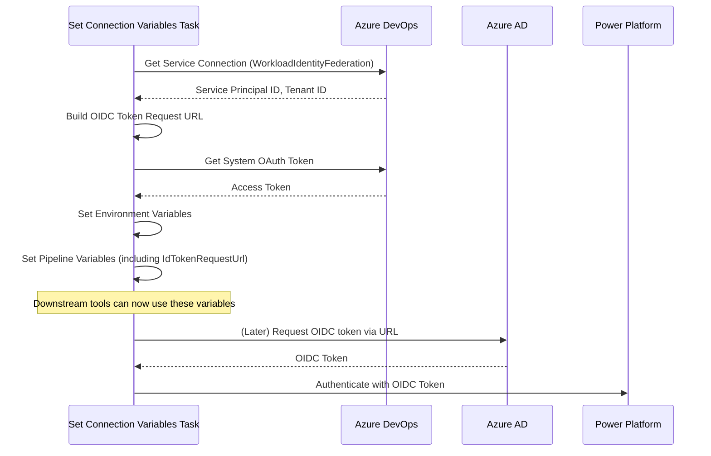

# Implementation Summary

## Overview

Successfully created an Azure DevOps extension with a task that reproduces and extends the Microsoft Power Platform Build Tools `set-connection-variables` task to support **WorkloadIdentityFederation** authentication.

## What Was Implemented

### 1. Core Task Implementation

Created a complete Azure DevOps task at `src/tasks/set-connection-variables/` with:

- **task.json**: Task metadata defining inputs, outputs, and execution settings
- **index.ts**: Main task implementation with support for three authentication methods:
  - WorkloadIdentityFederation (NEW)
  - Service Principal with Client Secret
  - Username/Password

### 2. WorkloadIdentityFederation Support

The key enhancement includes:

1. **Detection**: Automatically detects when a service connection uses `WorkloadIdentityFederation` scheme
2. **OIDC Token URL**: Builds the Azure DevOps OIDC token request URL dynamically
3. **Environment Variables**: Sets `PAC_ADO_ID_TOKEN_REQUEST_URL` and `PAC_ADO_ID_TOKEN_REQUEST_TOKEN` for downstream tools
4. **Pipeline Variables**: Exposes all authentication details as `BuildTools.*` variables
5. **Output Variable**: Sets `BuildTools.IdTokenRequestUrl` for use in custom scripts

### 3. Output Variables

The task sets the following pipeline variables:

| Variable | Description | Auth Types |
|----------|-------------|------------|
| `BuildTools.EnvironmentUrl` | Power Platform environment URL | All |
| `BuildTools.ApplicationId` | Service Principal/Application ID | SPN, WorkloadIdentity |
| `BuildTools.TenantId` | Azure AD Tenant ID | SPN, WorkloadIdentity |
| `BuildTools.ClientSecret` | Client secret (secret) | SPN only |
| `BuildTools.UserName` | Username (secret) | Username/Password only |
| `BuildTools.Password` | Password (secret) | Username/Password only |
| `BuildTools.DataverseConnectionString` | Complete connection string (secret) | All |
| `BuildTools.IdTokenRequestUrl` | OIDC token request URL | WorkloadIdentity only |

### 4. Supporting Modules

Created modular authentication helpers:

- `src/host/PipelineVariables.ts` - Variable name constants
- `src/params/auth/isRunningOnAgent.ts` - Agent detection
- `src/params/auth/getAuthenticationType.ts` - Auth type detection
- `src/params/auth/getEndpointName.ts` - Endpoint retrieval
- `src/params/auth/getEnvironmentUrl.ts` - Environment URL resolution

### 5. Project Infrastructure

- **package.json**: Project dependencies and build scripts
- **tsconfig.json**: TypeScript compilation configuration
- **vss-extension.json**: Azure DevOps extension manifest
- **build.sh**: Automated build script
- **.gitignore**: Excludes build artifacts and dependencies

### 6. Documentation

- **README.md**: Comprehensive documentation including:
  - Feature overview
  - Usage examples for all authentication types
  - Output variable reference
  - Build instructions
  - WorkloadIdentityFederation explanation
- **examples/azure-pipelines.yml**: Example pipeline demonstrating all three authentication methods

## Key Features

### Security

✅ **No vulnerabilities** detected by CodeQL analysis
✅ Secrets marked as secret variables
✅ Sensitive tokens masked in logs
✅ No hardcoded credentials

### Compatibility

✅ Based on official Microsoft Power Platform Build Tools reference implementation
✅ Maintains backward compatibility with existing authentication methods
✅ Supports Node 20.x runtime
✅ Works with Azure DevOps agents >= 2.144.0

### Extensibility

✅ Modular design for easy maintenance
✅ TypeScript for type safety
✅ Clear separation of concerns
✅ Follows Microsoft's architectural patterns

## How It Works: WorkloadIdentityFederation Flow



## Usage Example

```yaml
- task: ALM4DataverseSetConnectionVariables@1
  inputs:
    authenticationType: 'PowerPlatformSPN'
    PowerPlatformSPN: 'MyWorkloadIdentityConnection'
    Environment: 'https://myorg.crm.dynamics.com'

- task: PowerShell@2
  inputs:
    targetType: 'inline'
    script: |
      Write-Host "App ID: $(BuildTools.ApplicationId)"
      Write-Host "Tenant: $(BuildTools.TenantId)"
      Write-Host "OIDC URL: $(BuildTools.IdTokenRequestUrl)"
      # Use connection string: $(BuildTools.DataverseConnectionString)
```

## Building and Packaging

```bash
# Install dependencies
npm install

# Build TypeScript
npm run build

# Or use the build script
./build.sh

# Package extension (requires tfx-cli)
npm install -g tfx-cli
tfx extension create --manifest-globs vss-extension.json
```

## Files Structure

```
ALM4Dataverse-AzDOExtensions/
├── src/
│   ├── tasks/
│   │   └── set-connection-variables/
│   │       ├── index.ts          (Main implementation)
│   │       └── task.json         (Task metadata)
│   ├── params/auth/
│   │   ├── getAuthenticationType.ts
│   │   ├── getEndpointName.ts
│   │   ├── getEnvironmentUrl.ts
│   │   └── isRunningOnAgent.ts
│   └── host/
│       └── PipelineVariables.ts
├── dist/                         (Compiled output)
├── examples/
│   └── azure-pipelines.yml
├── package.json
├── tsconfig.json
├── vss-extension.json
├── build.sh
└── README.md
```

## Testing Recommendations

When deploying this extension:

1. Test with a WorkloadIdentityFederation service connection
2. Verify all pipeline variables are set correctly
3. Confirm the IdTokenRequestUrl is accessible to downstream tasks
4. Test with traditional SPN (client secret) for backward compatibility
5. Validate the Dataverse connection string format

## Next Steps

To use this extension in production:

1. Update the publisher in `vss-extension.json` to your organization
2. Generate an appropriate extension icon (replace placeholder in `images/`)
3. Build and package: `./build.sh && tfx extension create`
4. Publish to Azure DevOps Marketplace (private or public)
5. Install in your Azure DevOps organization
6. Create a WorkloadIdentityFederation service connection
7. Use the task in your pipelines

## References

- [Microsoft Power Platform Build Tools](https://github.com/microsoft/powerplatform-build-tools)
- [Azure DevOps OIDC Documentation](https://learn.microsoft.com/en-us/azure/devops/pipelines/release/configure-workload-identity)
- [Workload Identity Federation](https://learn.microsoft.com/en-us/azure/active-directory/develop/workload-identity-federation)
